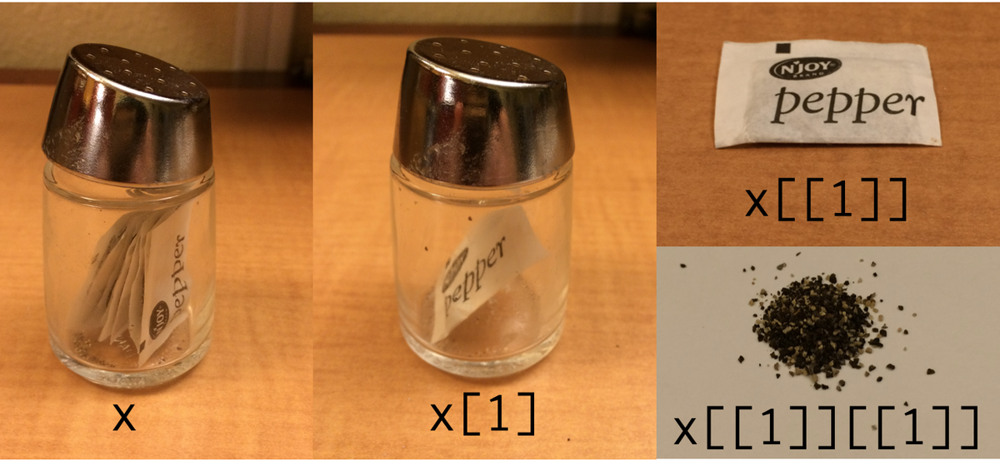

```{r setup, include=FALSE}
knitr::opts_chunk$set(echo = FALSE)
```

## ¿Que es una lista?

Una lista es una estructura de datos u objeto que en R puede contener distintos tipos de datos.
Desde vectores, arrays, matices e incluso otras listas. 

{height=400px}

## Difícil pero Útil

Generalmente tenemos dos problemas con las listas...

* Orden:
  Al poder contener tantas y tantos tipos de datos pueden volverse un caos díficil de entender.
* Manipulación:
  Extraer información puede requiere de selecciones consecuticas de los elementos:

{width=600px}

## ¿Como se Generan?

El comando `list()` nos permite generar una lista a mano


```{r Lista Manual, echo = TRUE}
mi.lista <- list(
  serie.de.numeros = 1:5,
  serie.de.letras = letters[20:25],
  una.matriz = matrix(sample(1:100, 20), ncol = 4),
  otra.lista = list(item1 = "Este es un item", item2 = "Este es el segundo item")
)

mi.lista
```

## Un mejor método

Sin embargo las listas se pueden generar de una función que las creé de forma automática. Lo que tiene mas sentido 
en un lenguaje de programación

```{r Lista Atuomática, echo = TRUE}
lista.raices.cuadradas <- lapply(2:5, function(x) x^2)
lista.raices.cuadradas
```

## Realmente Útiles

Se puede guardar un sujeto experimental por cada item de una lista y dentro de este guardar un dataframe con
las mediciones experimentales del mismo.

```{r Lista de Sujetos, echo = TRUE}
observaciones.por.sujeto <- sapply(
   c("s1", "s2", "s3"),
  function(x) data.frame(sujeto = x, id = 1:5, obs = sample(80:150, 5)),
  simplify = FALSE, USE.NAMES = TRUE
)
observaciones.por.sujeto
```

## Procesando Listas

Como en otras estructuras, la información se puede extraer con el uso de corchetes. La diferencia se da que al extraer
elementos de las listas se suelen usar dos pares de corchetes `[[]]` Esto es porque si extraemos con un par, el resultado
sigue siendo una lista:

```{r Extrae primer elemento, echo = TRUE}
observaciones.por.sujeto[1]
```

## Extrayendo Elemento

En este caso se extrae el data.frame interno:

```{r Extrae segundo elemento, echo = TRUE}
observaciones.por.sujeto[[2]]
```

## Usando nombres

Es muy común extraer elementos usando la posición de los mismos:

```{r Lista sin nombres, echo = TRUE}
lista.sin.nombres <- list(1:3, letters[3:7], "un elemento mas")
lista.sin.nombres[[2]]
```

Cuando las listas se crean usando nombres, se pueden extraer elementos usandolos:

```{r Lista con nombres, echo = TRUE}
lista.con.nombres <- list(
  numeros = 1:3, letras = letters[3:7], oracion = "un elemento mas"
)
lista.con.nombres[['letras']]
```

## Extrayendo elementos

De la misma forma en la que se extraen elementos de una lista, **concatenando** extracciones, se puede obtener elementos

```{r Concatenados, echo = TRUE}
lista.con.nombres[['letras']][2]
```

```{r Concatenado posicición, echo = TRUE}
observaciones.por.sujeto[[2]]$id
```

## Listas anidadas

Y por lo tanto para extraer una  elemento de una lista dentro de ptra lista, se usan extracciones en secuencia

```{r Una lista dentro de otra, echo = TRUE}
mi.lista[["otra.lista"]][["item2"]]
```

